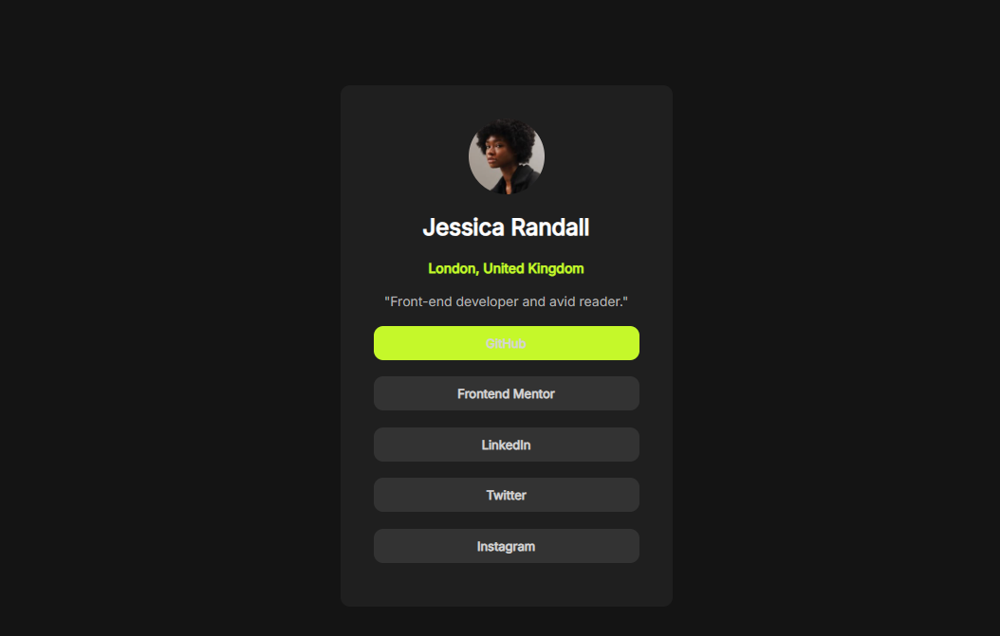

# Frontend Mentor - Social links profile solution

This is a solution to the [This challenge on Frontend Mentor](https://www.frontendmentoer.io/challenges/social-links-profile-UG32l9m6dQ). Frontend Mentor challenges help you improve your coding skills by building realistic projects. 

## Table of contents

  - [The challenge](#the-challenge)
  - [Links](#links)
  - [Screenshot](#screenshot) 
  - [Built with](#built-with)
  - [What I learned](#what-i-learned)
  - [Author](#author)
  - [Acknowledgments](#acknowledgments)


### The challenge

Users should be able to:

- See hover and focus states for all interactive elements on the page

### Links

- Solution URL: [Git_hub](https://github.com/NITHISHKUMAR0283/Social-link-profile)
- Live Site URL: [click_here](https://nithishkumar0283.github.io/Social-link-profile/)


### Screenshot




### Built with

- Semantic HTML5 markup
- CSS custom properties
- CSS Grid


### What I learned

" To add custom text available online to my website and transition of the button when hover over it"

```html
<link href="https://fonts.googleapis.com/css2?family=Inter&display=swap" rel="stylesheet">

```
```css
.option1 {
   transition: background-color 0.3s ease;
}
```


## Author

- Website - [nithish](https://nithishkumar0283.github.io/Social-link-profile/)
- Frontend Mentor - [@NITHISHKUMAR0283](https://www.frontendmentor.io/profile/NITHISHKUMAR0283)

## Acknowledgments

Actually frontend mentor challenges gives you the reason to code... try the challenges and build projects and develope, Thankyou...